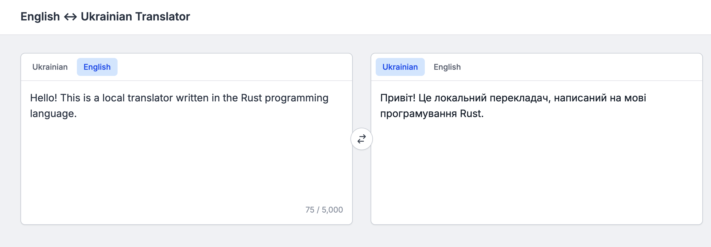

# Kulyk Translator using Rust

This is a Rust-based translator that utilizes the `llama-cpp-2` crate to inference Kulyk models.

Created for the Rustcamp 2025 Summer: https://github.com/rust-lang-ua/rustcamp_ml

## Demo

<a href="./screenshot.png"></a>

## Models

- Models: 
    - https://huggingface.co/Yehor/kulyk-uk-en
    - https://huggingface.co/Yehor/kulyk-en-uk
- GGUF Models:
    - https://huggingface.co/mradermacher/kulyk-uk-en-GGUF
    - https://huggingface.co/mradermacher/kulyk-en-uk-GGUF

## Build

```shell
cargo build --release
```

## Usage

```shell
# this command will download quantized GGUF models
just download_models

# start web server and navigate to http://localhost:3000 in your browser
just run
```

## Run using Docker

```shell
docker run -p 3000:3000 --rm ghcr.io/egorsmkv/kulyk-rust:latest
```

## High-Load test

- Test set: https://huggingface.co/datasets/speech-uk/text-to-speech-sentences
- Threads: 16
- GPU: NVIDIA GeForce RTX 3090
- Memory usage: 1190MiB
- Average inference speed per sentence: 0.0537 sec = 53.7 ms

## Acknowledgements

This project is based on the following repositories:

- [`simple` example from llama-cpp-2](https://github.com/utilityai/llama-cpp-rs/tree/main/examples/simple)
